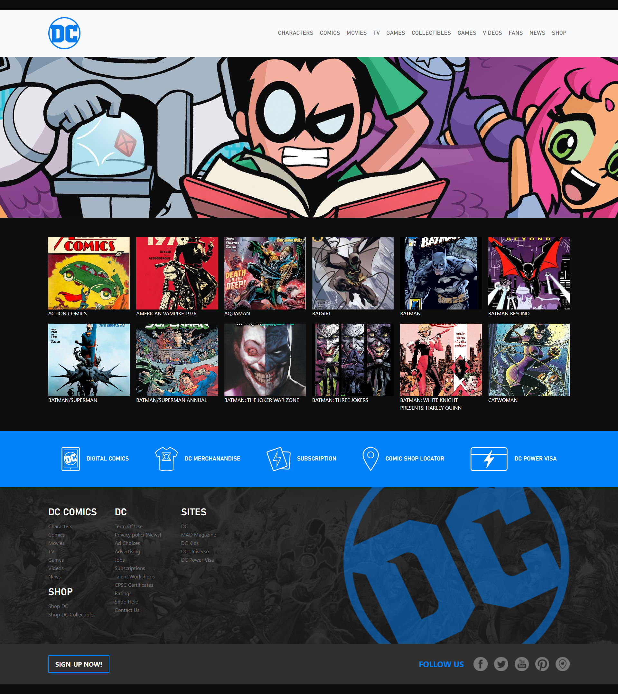

# Web-page DC Comix
Replica della landing page del sito DC-Comix. Questo è stato uno dei primi approcci con la **CLI di Vite** un utile strumento per lo sviluppo front-end. È stato fondamentale il preprocessore **Sass** e il compilatore dei vue-component per prelevare i dati da array e poi caricarli in modo dinamico in pagina. 

# Milestone
- Modifico App.vue e cancello style.css
- Creo cartella scss con app.scss e relativi partials.
- Modifico app.js per importare app.scss
- Importo i pacchetti (`npm add -d sass`. `npm install bootstrap`)
